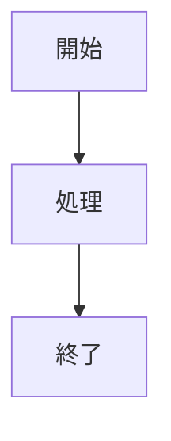

# 仕様駆動開発時代のドキュメント基盤

仕様駆動開発時代におけるドキュメント基盤のテンプレート。

Markdown文書を静的サイトジェネレーターでHTMLに変換・公開することで、つぎを実現しする。

- Markdownによる文書記述
- Mermaidによる図表作成
- Draw.ioによるSVG図表作成
- GitHub Pages*1 もしくはAzure Static Web Apps（以降SWA）による正式文書公開
- Pull Request時にSWAでのプレビュー
- GitHubリポジトリの権限に応じたセキュリティ管理*1

*1: GitHub Pagesでリポジトリ権限に応じた閲覧制御を行うには、GitHub Enterpriseプランが必要

## 技術スタック

| 技術 | 用途 |
|------|------|
| MkDocs + Material for MkDocs | 静的サイトジェネレーター |
| Mermaid | Markdown内での図表作成 |
| Draw.io | SVG図表作成 |
| Playwright | Mermaidレンダリング用ブラウザ自動化 |
| WeasyPrint | PDF生成 |
| textlint | ドキュメント品質チェック |

## 外部リソース

- [デモサイト](https://mango-water-099741f10.3.azurestaticapps.net/)
- [プロポーザル](https://mango-water-099741f10.3.azurestaticapps.net/%E3%83%97%E3%83%AD%E3%83%9D%E3%83%BC%E3%82%B6%E3%83%AB/)
- [プレゼン資料](https://mango-water-099741f10.3.azurestaticapps.net/%E3%82%B9%E3%83%A9%E3%82%A4%E3%83%89/genai-documentation-infrastructure.html)

## 技術スタック

- Markdown
- **[MkDocs(Material for MkDocs)](https://squidfunk.github.io/mkdocs-material/)**: 静的サイトジェネレーター
- **[Mermaid](https://mermaid.js.org/)**: 図表作成ライブラリ
- **[Draw.io（diagrams.net）](https://app.diagrams.net/)**: SVG描画ツール
- **[Marp](https://marp.app/)**: Markdownプレゼンテーションツール

## 利用サービス・ツール

- Coding Agent（Codex CLI, Claude Code, GitHub Copilotなど）
- GitHub
   - GitHub Actions
- Azure Static Web Apps
   - [swa-github-repo-auth](https://github.com/nuitsjp/swa-github-repo-auth)
- Visual Studio Code
   - [Draw.io Integration](https://marketplace.visualstudio.com/items?itemName=hediet.vscode-drawio)
   - [テキスト校正くん](https://marketplace.visualstudio.com/items?itemName=ICS.japanese-proofreading)
- MkDocs
   - Python
   - [uv](https://docs.astral.sh/uv/)
   - [mkdocs-mermaid-to-image](https://pypi.org/project/mkdocs-mermaid-to-image/)
   - [mkdocs-svg-to-png](https://pypi.org/project/mkdocs-svg-to-png/)
   - [mkdocs-to-pdf](https://pypi.org/project/mkdocs-to-pdf/)
   - [mkdocs-table-reader-plugin](https://pypi.org/project/mkdocs-table-reader-plugin/)
- Marp
   - [Node.js](https://nodejs.org/)
- Excel
   - [CopyToMarkdownAddIn](https://github.com/nuitsjp/CopyToMarkdownAddIn)

----------------------------------------------

以下、T.B.D

## 🚀 セットアップ

### 前提条件

- Windows 10/11
- PowerShell 5.1 以上
- インターネット接続（パッケージダウンロード用）

### 自動セットアップ

管理者権限でPowerShellを起動し、以下のコマンドを実行してください：

```powershell
.\scripts\Setup-Environments.ps1
```

このスクリプトは以下を自動でインストール・セットアップする：

- Python 3.13
- uv（Python環境管理）
- Node.js
- Mermaid CLI
- GTK+ Runtime（PDF生成用）
- プロジェクト依存関係

### 手動セットアップ

1. **リポジトリのクローン**
   ```bash
   git clone <repository-url>
   cd DocumentationStrategy
   ```

2. **Python環境のセットアップ**
   ```bash
   uv sync
   ```

3. **開発サーバーの起動**
   ```bash
   uv run mkdocs serve
   ```

4. **ブラウザでアクセス**
   ```
   http://localhost:8000
   ```

## 📝 使用方法

### ローカル開発

```bash
# 開発サーバー起動
uv run mkdocs serve

# 本番ビルド
uv run mkdocs build

# PDF生成
uv run mkdocs build --config-file mkdocs.yml
```

### ドキュメント編集

1. `docs/` ディレクトリ内のMarkdownファイルを編集
2. Mermaid図表は、コードブロック内で `mermaid` 言語を指定
3. 変更は自動的にライブリロードで反映

### 新しい図表の追加

````markdown

````

## 📁 プロジェクト構造

```
DocumentationStrategy/
├── docs/                          # ドキュメントソース
│   ├── 01.システム設計/           # システム設計関連
│   ├── プロセス・フロー/          # プロセス図表
│   ├── プロジェクト管理/          # プロジェクト管理図表
│   ├── stylesheets/               # カスタムCSS
│   └── index.md                   # トップページ
├── scripts/                       # セットアップスクリプト
├── mkdocs.yml                     # MkDocs設定
├── pyproject.toml                 # Python依存関係
└── README.md                      # このファイル
```

## 🔧 設定

### MkDocs設定（mkdocs.yml）

主要な設定項目：

- **テーマ**: Material for MkDocs（日本語対応）
- **プラグイン**: 
  - `mermaid-to-image`: PDF出力用の図表変換
  - `to-pdf`: PDF生成機能
- **拡張機能**: Mermaid図表サポート、コードハイライト

### Python依存関係（pyproject.toml）

- MkDocs関連パッケージ
- PDF生成用ライブラリ（WeasyPrint）
- Mermaid図表処理プラグイン

## 📄 PDF出力

ビルド時に自動的にPDFが生成される：

```bash
uv run mkdocs build
```

生成されたPDF: `site/pdf/ドキュメンテーション戦略.pdf`

## 🤝 コントリビューション

1. このリポジトリをフォーク
2. フィーチャーブランチを作成
3. 変更をコミット
4. プルリクエストを送信

## 🆘 トラブルシューティング

### よくある問題

1. **PDF生成エラー**
   - GTK+ Runtimeがインストールされているか確認
   - WeasyPrintの依存関係を確認

2. **Mermaid図表が表示されない**
   - ブラウザのキャッシュをクリア
   - JavaScriptが有効になっているか確認

3. **セットアップスクリプトが動作しない**
   - PowerShellを管理者権限で実行
   - ExecutionPolicyを確認

### サポート

問題が発生した場合は、GitHubのIssuesで報告すること。
