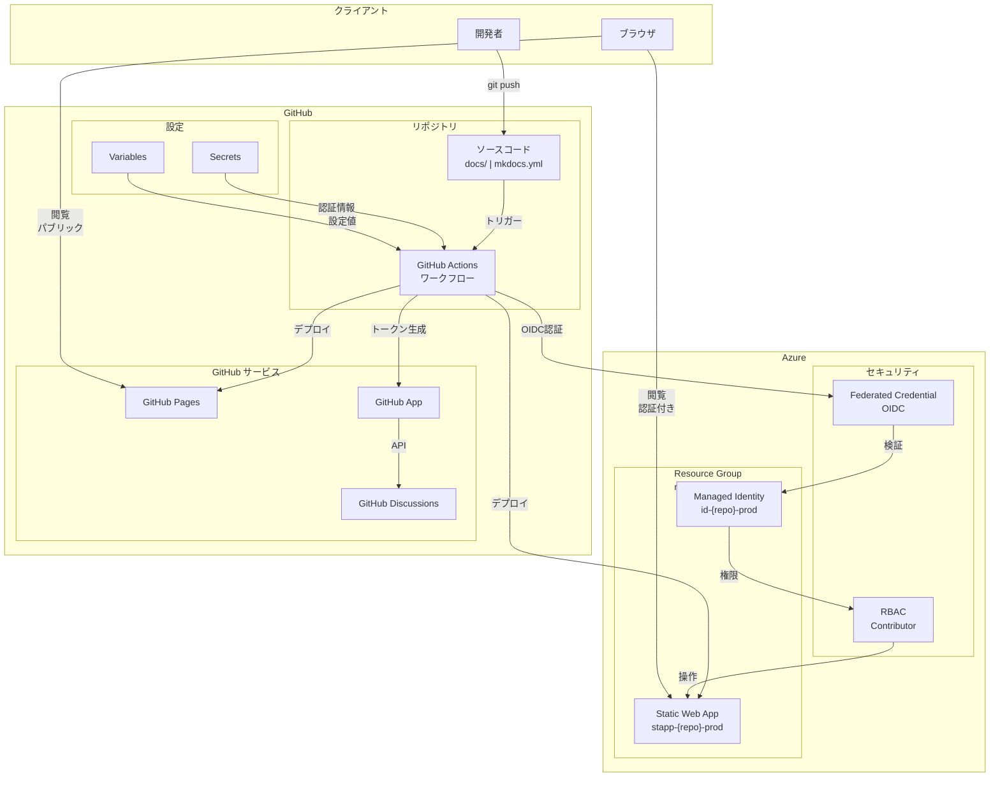
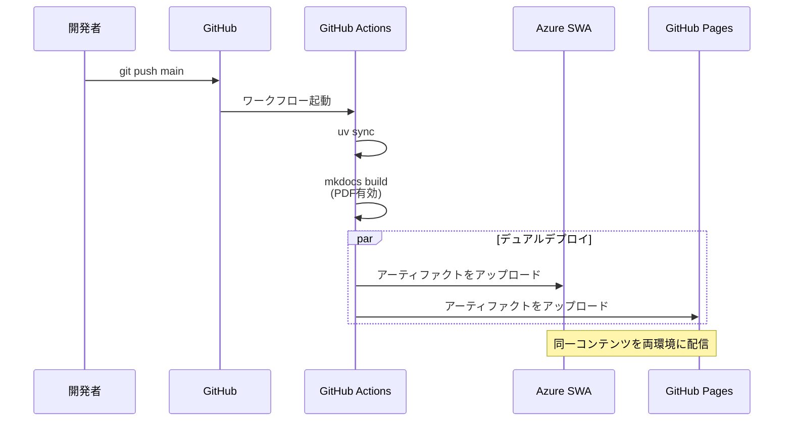
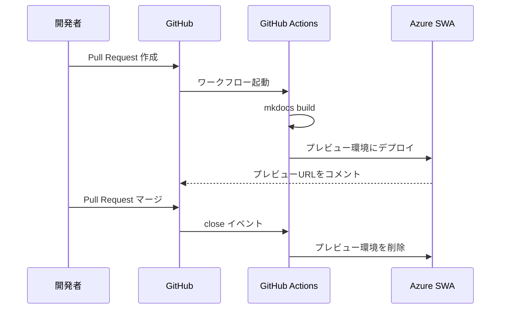
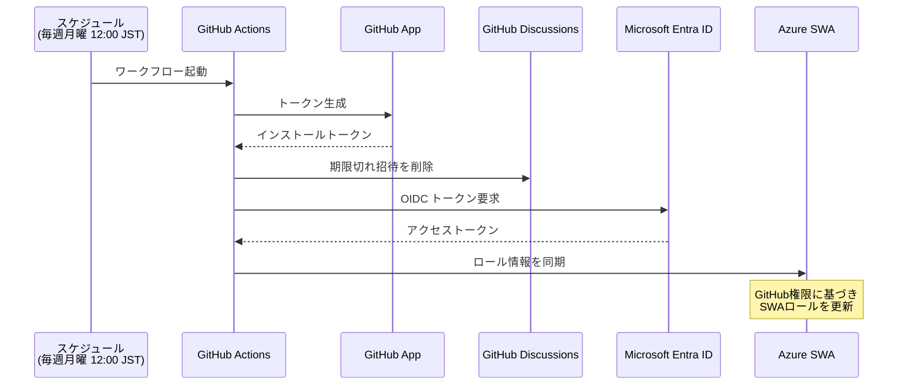
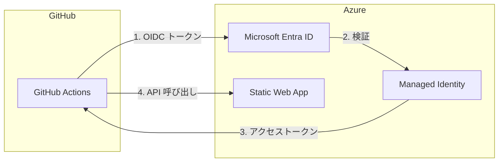
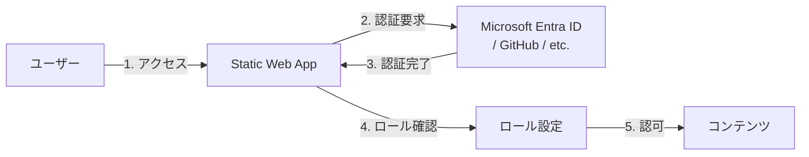

# デプロイ構成

本ドキュメント基盤のデプロイアーキテクチャについて説明する。

## 概要

本システムは GitHub と Azure を組み合わせたハイブリッド構成で、以下の特徴を持つ。

- **デュアルデプロイ**: GitHub Pages と Azure Static Web Apps（SWA）への同時デプロイ
- **PRプレビュー**: Pull Request 作成時に Azure SWA でプレビュー環境を自動生成
- **OIDC認証**: GitHub Actions から Azure へのパスワードレス認証
- **ロールベースアクセス制御**: GitHub リポジトリ権限に基づく閲覧制御（SWA）

## 配置モデル

## コンポーネント詳細

### GitHub 側リソース

| リソース | 用途 |
|----------|------|
| リポジトリ | Markdown ソース、MkDocs 設定、ワークフロー定義を格納 |
| GitHub Actions | CI/CD パイプライン。ビルド・デプロイ・ロール同期を実行 |
| GitHub Pages | 静的サイトのパブリック公開（Enterprise で認証制御可能） |
| GitHub Discussions | SWA の招待管理。閲覧権限のリクエストを受け付け |
| GitHub App | Discussions API への書き込み権限を持つアプリケーション |
| Secrets | `AZURE_SWA_API_TOKEN`, `ROLE_SYNC_APP_PRIVATE_KEY` |
| Variables | `AZURE_CLIENT_ID`, `AZURE_TENANT_ID`, `AZURE_SUBSCRIPTION_ID`, `AZURE_SWA_NAME`, `AZURE_SWA_RESOURCE_GROUP`, `ROLE_SYNC_APP_ID` |

### Azure 側リソース

| リソース | 用途 |
|----------|------|
| Resource Group | 関連リソースをグルーピング |
| Static Web App | 静的サイトのホスティング。認証・認可機能を内蔵 |
| Managed Identity | GitHub Actions が Azure を操作するための ID |
| Federated Credential | OIDC による GitHub Actions との信頼関係 |
| RBAC | Managed Identity に SWA への Contributor 権限を付与 |

## デプロイフロー

### 本番デプロイ（main ブランチ）

### PR プレビュー

### ロール同期

## 認証・認可モデル

### OIDC フェデレーション

GitHub Actions から Azure への認証には OIDC（OpenID Connect）を使用する。これによりシークレットの長期保存が不要となる。

**信頼関係の設定**:

- **Issuer**: `https://token.actions.githubusercontent.com`
- **Subject**: `repo:{owner}/{repo}:ref:refs/heads/main`
- **Audience**: `api://AzureADTokenExchange`

### SWA 認証フロー

Azure Static Web Apps は組み込みの認証機能を提供する。

## 環境構成の比較

| 項目 | GitHub Pages | Azure Static Web Apps |
|------|--------------|----------------------|
| URL | `{owner}.github.io/{repo}` | `*.azurestaticapps.net` |
| 認証 | なし（Enterprise で可能） | Microsoft Entra ID / GitHub / カスタム |
| PRプレビュー | なし | あり（自動生成） |
| カスタムドメイン | 可能 | 可能 |
| 料金 | 無料 | Free / Standard |

## 関連ドキュメント

- [クラウド環境構築](../cloud-resources-setup.md) - Azure / GitHub リソースの構築手順
- [テキスト校正](text-validation.md) - textlint による品質管理
