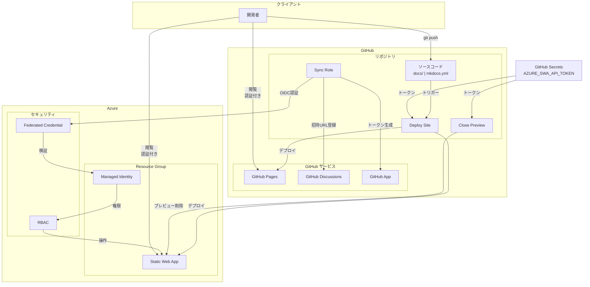
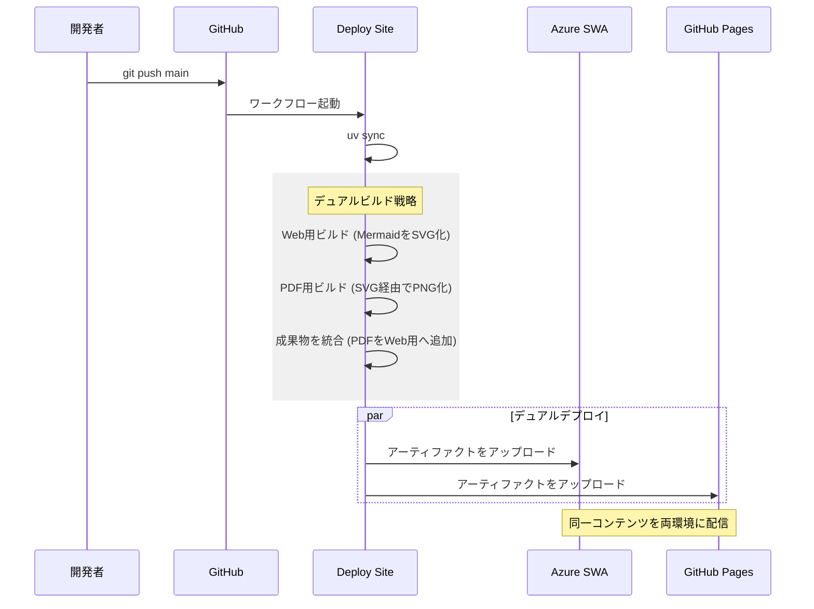
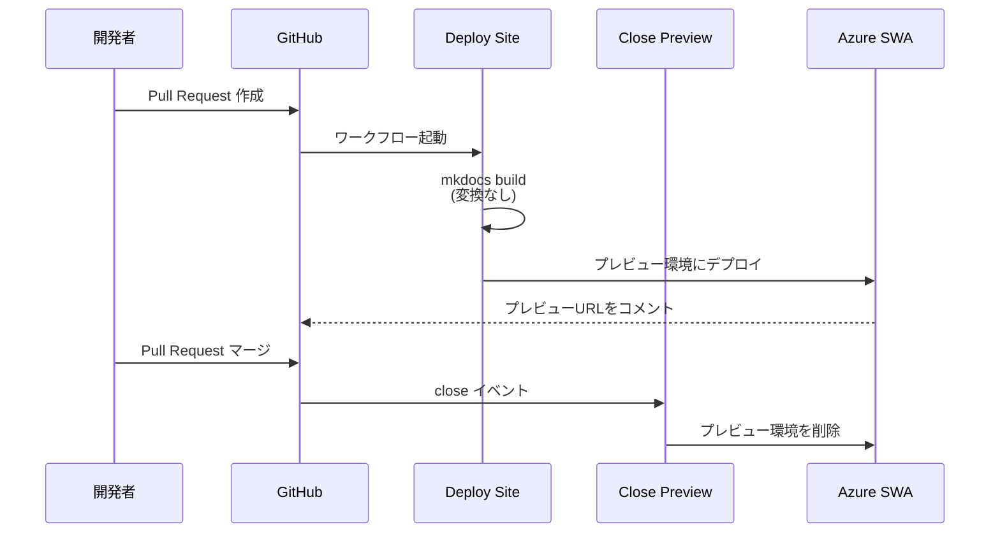
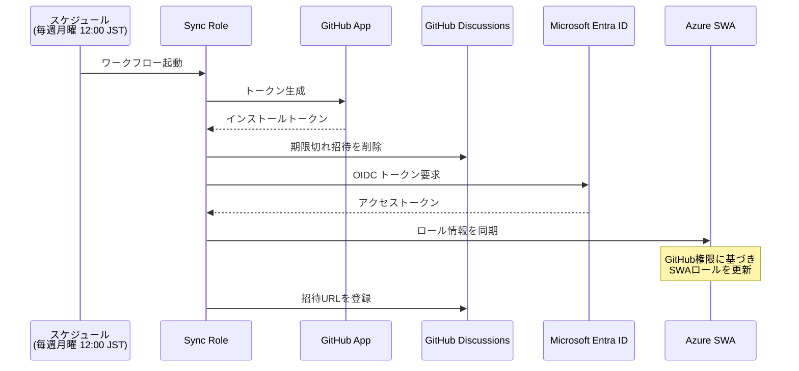
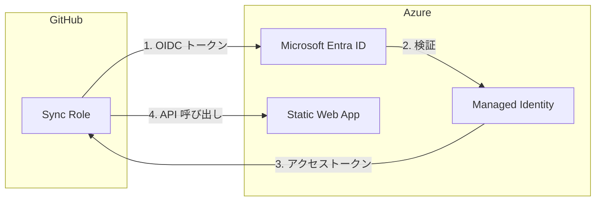
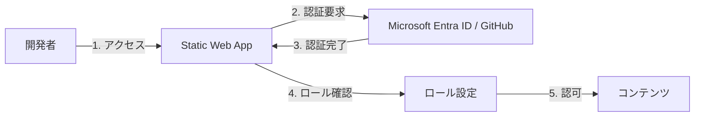

# デプロイ構成

本ドキュメント基盤のデプロイアーキテクチャについて説明する。

## 概要

本システムは GitHub と Azure を組み合わせたハイブリッド構成で、以下の特徴を持つ。

- **デュアルデプロイ**: GitHub Pages と Azure Static Web Apps（SWA）への同時デプロイ
- **役割の分離**: 広範な閲覧は GitHub Pages、PRプレビューや限定配布は SWA を主に使用（同一成果物を両環境へ配布）
- **スケーラビリティ**: SWA のロール認証制限（25人）を補うため、広範な閲覧には Pages を活用
- **OIDC認証**: Sync Role が OIDC で Azure にログインして SWA ロールを同期（Azure 資格情報の長期保存を回避）
- **SWA API トークン**: Deploy Site / Close Preview が `AZURE_SWA_API_TOKEN` で SWA へデプロイ・プレビュー削除
- **ロールベースアクセス制御**: リポジトリ権限に基づく閲覧制御（SWA および Enterprise 版 Pages）
- **招待管理**: GitHub Discussions を活用した閲覧権限の配布と承認フロー（SWA用）
- **最適化されたビルド**: Web 表示用には軽量な SVG、PDF 生成用には互換性の高い PNG を使い分け

## 配置モデル

## コンポーネント詳細

### GitHub 側リソース

| リソース | 用途 |
|----------|------|
| リポジトリ | Markdown ソース、MkDocs 設定、ワークフロー定義を格納 |
| Deploy Site | CI/CD パイプライン。ビルド・デプロイを実行 |
| Sync Role | ロール同期ジョブ。閲覧権限の管理を自動化 |
| GitHub Pages | 静的サイトのホスティング。Private リポジトリ + Enterprise で認証制御可能 |
| GitHub Discussions | SWA の招待管理。Sync Role が生成した招待 URL を登録 |
| GitHub App | Discussions API への書き込み権限を持つアプリケーション |

### Azure 側リソース

| リソース | 用途 |
|----------|------|
| Resource Group | 関連リソースをグルーピング |
| Static Web App | 静的サイトのホスティング。認証・認可機能を内蔵 |
| Managed Identity | GitHub Actions が Azure を操作するための ID |
| Federated Credential | OIDC による GitHub Actions との信頼関係 |
| RBAC | Managed Identity に SWA への Contributor 権限を付与 |

## デプロイフロー

### 本番デプロイ（main ブランチ）

### PR プレビュー

**注意**:

- fork からの Pull Request では `AZURE_SWA_API_TOKEN` が利用できず、SWA のプレビュー作成/削除が失敗する可能性がある。SWA プレビューを有効にする場合は「同一リポジトリ内 PR」を前提とし、必要に応じてワークフロー側で fork PR をスキップする。

### ロール同期

## 認証・認可モデル

### OIDC フェデレーション

Sync Role の Azure への認証には OIDC（OpenID Connect）を使用する。これにより Azure 資格情報（クライアントシークレット等）の長期保存が不要となる。

### SWA デプロイの認証

SWA へのデプロイと PR プレビューの削除には `AZURE_SWA_API_TOKEN`（GitHub Secrets）を使用する。

**信頼関係の設定**:

- **Issuer**: `https://token.actions.githubusercontent.com`
- **Subject**: `repo:{owner}/{repo}:ref:refs/heads/main`
- **Audience**: `api://AzureADTokenExchange`

### SWA 認証フロー

Azure Static Web Apps は組み込みの認証機能を提供する。

## 環境構成の比較

| 項目 | GitHub Pages | Azure Static Web Apps |
|------|--------------|----------------------|
| 用途 | **正式公開（マージ後）** | **PRプレビュー / 開発用** |
| URL | `{owner}.github.io/{repo}` | `*.azurestaticapps.net` |
| 認証 | リポジトリ権限（Enterprise） | Microsoft Entra ID / GitHub / カスタム |
| 閲覧人数制限 | **制限なし**（リポジトリ権限に従う） | **最大 25 人**（カスタムロール使用時） |
| PRプレビュー | なし | あり（自動生成） |
| カスタムドメイン | 可能 | 可能 |
| 料金 | 無料 | Free / Standard |

## 関連ドキュメント

- [ワークフロー アーキテクチャ](workflow-architecture.md) - GitHub Actions ワークフローの詳細
- [クラウド環境構築](../cloud-resources-setup.md) - Azure / GitHub リソースの構築手順
- [テキスト校正](text-validation.md) - textlint による品質管理
