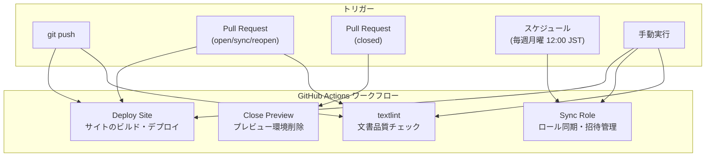
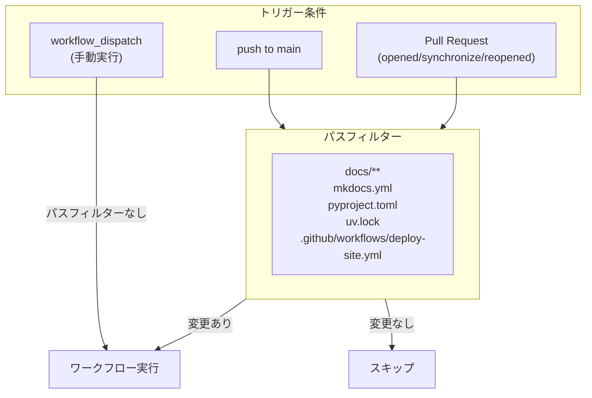
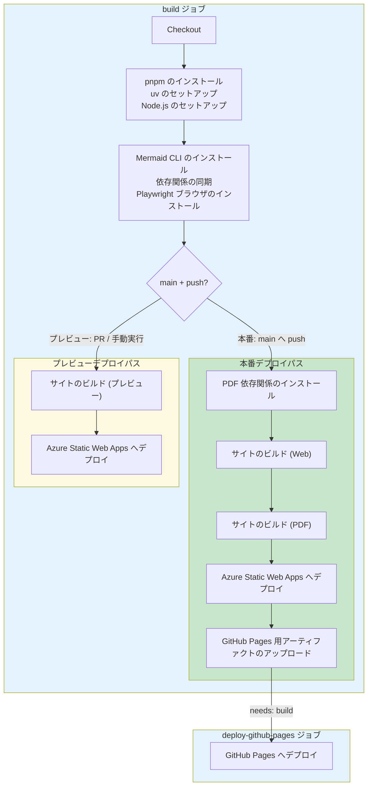
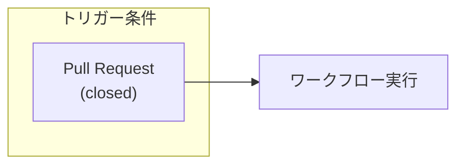
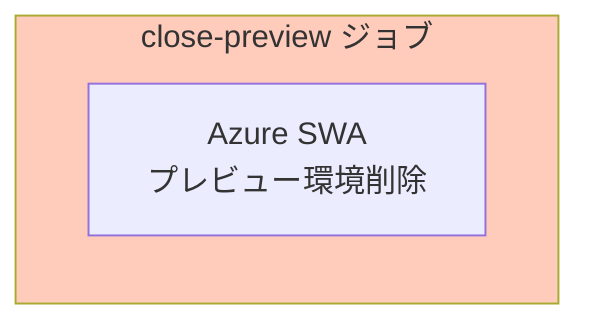
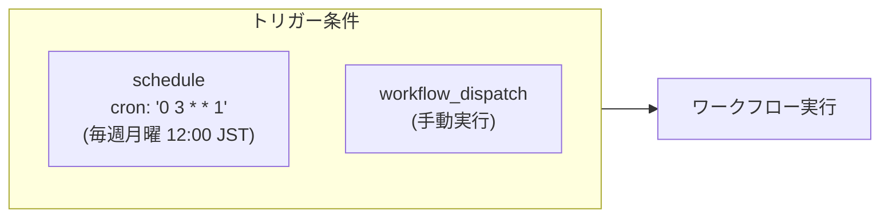
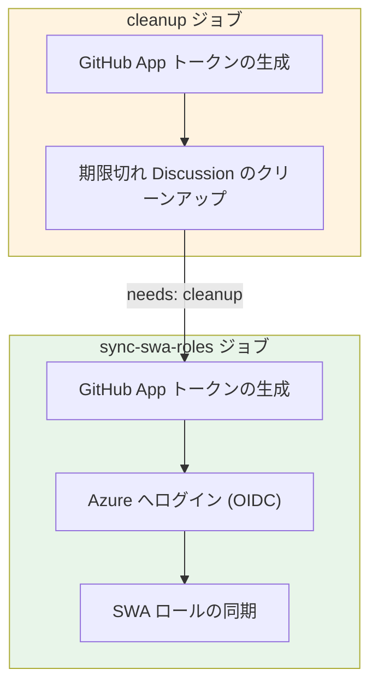
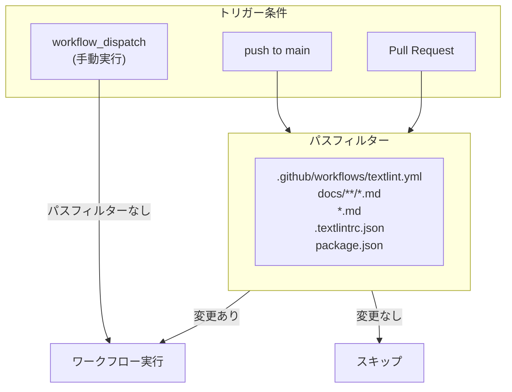
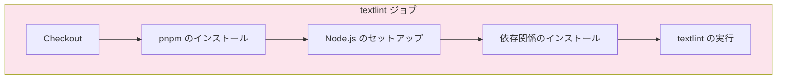
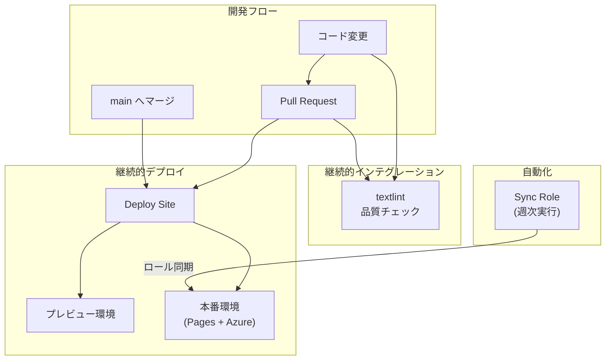

# ワークフロー アーキテクチャ

本リポジトリで使用する GitHub Actions ワークフローの実行条件と内部構造について説明する。

## ワークフロー概要

本システムでは以下の 4 つのワークフローを使用する。



| ワークフロー | ファイル | 主な役割 |
|-------------|---------|--------|
| Deploy Site | `.github/workflows/deploy-site.yml` | MkDocs サイトのビルドと GitHub Pages / Azure SWA へのデプロイ |
| Close Preview | `.github/workflows/close-preview.yml` | PR クローズ時に Azure SWA のプレビュー環境を削除 |
| Sync Role | `.github/workflows/role-sync-released.yml` | GitHub 権限に基づく Azure SWA ロールの同期と招待管理 |
| textlint | `.github/workflows/textlint.yml` | Markdown 文書の日本語品質チェック |

---

## Deploy Site ワークフロー

### 実行条件



| トリガー | 条件 | パスフィルター |
|---------|------|--------------|
| `push` | `main` ブランチへのプッシュ | `docs/**`, `mkdocs.yml`, `pyproject.toml`, `uv.lock`, `.github/workflows/deploy-site.yml` |
| `pull_request` | opened, synchronize, reopened | 同上 |
| `workflow_dispatch` | 手動実行 | なし（常に実行） |

### 権限

```yaml
permissions:
  contents: read       # リポジトリ読み取り
  pages: write         # GitHub Pages への書き込み
  id-token: write      # OIDC トークン取得
  pull-requests: write # PR コメント
```

### ジョブ構成

ワークフローは `build` ジョブと `deploy-github-pages` ジョブの2つで構成される。



### ジョブ詳細

#### build ジョブ

| ステップ | 説明 | 条件 |
|---------|------|------|
| Checkout | サブモジュール含むチェックアウト | - |
| pnpm のインストール | pnpm パッケージマネージャー | - |
| uv のセットアップ | Python (uv) 環境構築 | - |
| Node.js のセットアップ | Node.js 20 環境構築 | - |
| Mermaid CLI のインストール | `@mermaid-js/mermaid-cli` グローバルインストール | - |
| 依存関係の同期 | `uv sync` による Python 依存関係 | - |
| Playwright ブラウザのインストール | Chromium ブラウザ | - |
| PDF 依存関係のインストール | PDF 生成用システムライブラリ | main + push 時のみ |
| サイトのビルド (Web) | SVG 変換でビルド | main + push 時のみ |
| サイトのビルド (PDF) | PNG 変換 + PDF 生成 | main + push 時のみ |
| サイトのビルド (プレビュー) | 変換なしでビルド | main + push 以外 |
| Azure Static Web Apps へデプロイ | サイトをデプロイ | - |
| GitHub Pages 用アーティファクトのアップロード | Pages 用アーティファクト | main + push 時のみ |

#### deploy-github-pages ジョブ

**依存**: `build` ジョブ完了後  
**実行条件**: main ブランチへの push 時のみ

!!! note "別ジョブとして分離している理由"
    GitHub Pages へのデプロイは `build` ジョブに統合せず、別ジョブとして実装している。理由は以下の通り。
    
    1. **Environments UI での追跡**: `environment` 設定により、GitHub UI の「Environments」タブでデプロイ履歴とステータスを確認可能
    2. **リトライ容易性**: デプロイ失敗時に `build` を再実行せず、デプロイのみをリトライ可能
    3. **公式推奨パターン**: GitHub 公式ドキュメントで推奨されている `upload-pages-artifact` → 別ジョブで `deploy-pages` というパターンに準拠

---

## Close Preview ワークフロー

PR がクローズされた際に、Azure SWA のプレビュー環境を削除する専用ワークフロー。

### 実行条件



| トリガー | 条件 |
|---------|------|
| `pull_request` | closed |

### 権限

```yaml
permissions:
  contents: read  # リポジトリ読み取りのみ
```

### ジョブ構成



### ジョブ詳細

#### close-preview ジョブ

Azure Static Web Apps のプレビュー環境を削除する。

| ステップ | 説明 | 使用アクション |
|---------|------|---------------|
| プレビュー環境のクローズ | プレビュー環境の削除 | `Azure/static-web-apps-deploy@v1` |

---

## Sync Role ワークフロー

### 実行条件



| トリガー | 条件 |
|---------|------|
| `schedule` | 毎週月曜日 03:00 UTC（日本時間 12:00） |
| `workflow_dispatch` | 手動実行 |

### 権限

```yaml
permissions:
  id-token: write    # OIDC トークン取得（Azure 認証用）
  contents: read     # リポジトリ読み取り
  discussions: write # Discussions への書き込み
```

### 環境変数

| 変数 | 説明 | ソース |
|-----|------|-------|
| `SWA_NAME` | Azure Static Web App 名 | `vars.AZURE_SWA_NAME` |
| `SWA_RG` | リソースグループ名 | `vars.AZURE_SWA_RESOURCE_GROUP` |
| `DISCUSSION_CATEGORY` | 招待用カテゴリ名 | `Invitation` (固定値) |

### ジョブ構成



### ジョブ詳細

#### cleanup ジョブ

期限切れの招待 Discussion を削除する。

| ステップ | 説明 | 使用アクション |
|---------|------|---------------|
| GitHub App トークンの生成 | GitHub App からインストールトークンを生成 | `actions/create-github-app-token@v1` |
| 期限切れ Discussion のクリーンアップ | 期限切れ招待を削除 | `nuitsjp/swa-github-discussion-cleanup@v1` |

#### sync-swa-roles ジョブ

**依存**: `cleanup` ジョブ完了後

GitHub リポジトリ権限に基づき Azure SWA のロールを同期し、招待 URL を Discussions に登録する。

| ステップ | 説明 | 使用アクション |
|---------|------|---------------|
| GitHub App トークンの生成 | GitHub App からインストールトークンを生成 | `actions/create-github-app-token@v1` |
| Azure へログイン (OIDC) | OIDC でパスワードレスログイン | `azure/login@v2` |
| SWA ロールの同期 | ロール同期と招待 URL 登録 | `nuitsjp/swa-github-role-sync@v1` |

---

## textlint ワークフロー

### 実行条件



| トリガー | 条件 | パスフィルター |
|---------|------|--------------|
| `push` | `main` ブランチへのプッシュ | `.github/workflows/textlint.yml`, `docs/**/*.md`, `*.md`, `.textlintrc.json`, `package.json` |
| `pull_request` | すべてのタイプ | 同上 |
| `workflow_dispatch` | 手動実行 | なし（常に実行） |

### 権限

```yaml
permissions:
  contents: read  # リポジトリ読み取りのみ
```

### ジョブ構成



### ジョブ詳細

#### textlint ジョブ

Markdown 文書の日本語品質をチェックする。

| ステップ | 説明 | 備考 |
|---------|------|-----|
| Checkout | リポジトリのチェックアウト | - |
| pnpm のインストール | pnpm パッケージマネージャー | - |
| Node.js のセットアップ | Node.js 20 環境構築 | pnpm キャッシュ有効 |
| 依存関係のインストール | pnpm install | `--frozen-lockfile` で厳密インストール |
| textlint の実行 | pnpm run lint:text | エラー時はワークフロー失敗 |

---

## ワークフロー間の関係



## 関連ドキュメント

- [デプロイ構成](deploy-architecture.md) - デプロイアーキテクチャの詳細
- [テキスト校正](text-validation.md) - textlint のルール設定
- [クラウド環境構築](../cloud-resources-setup.md) - Azure / GitHub リソースの構築手順
