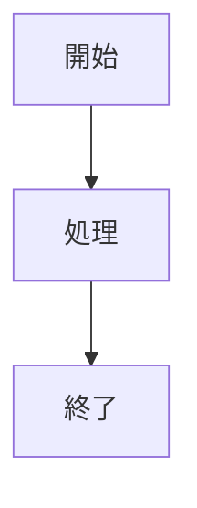
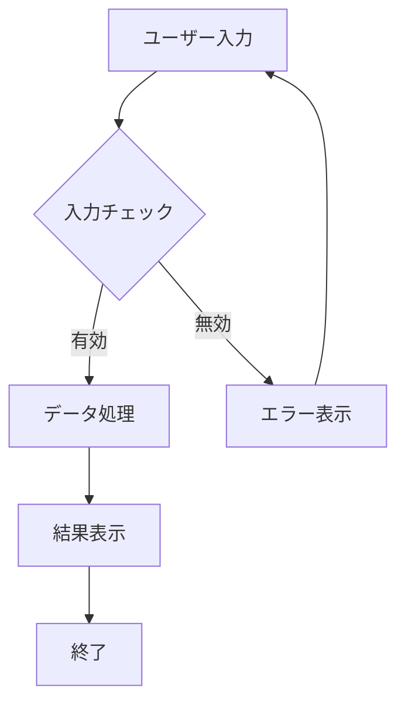
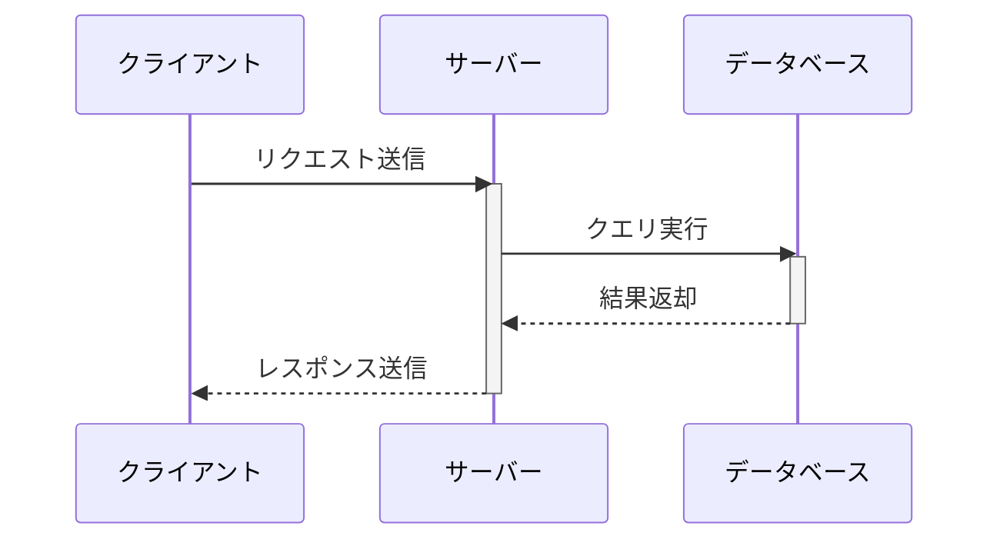
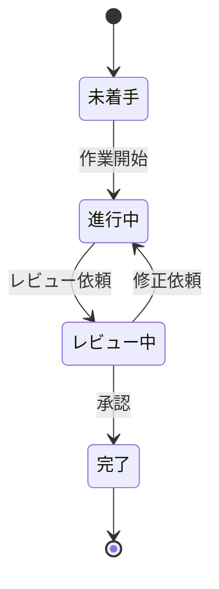
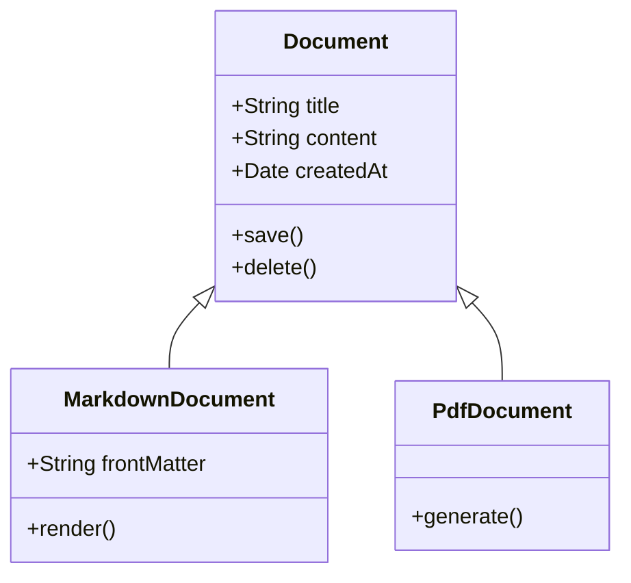
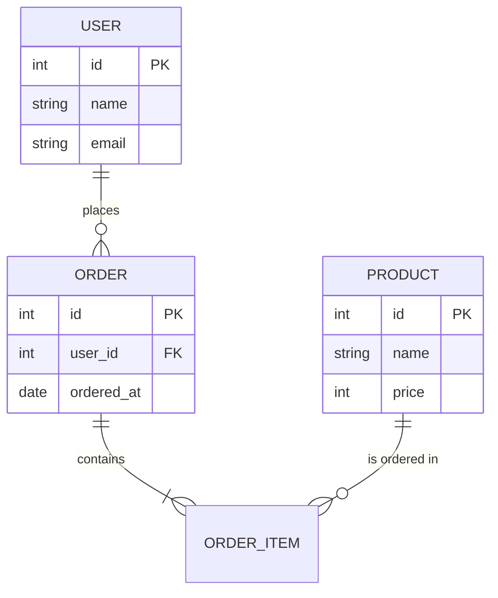
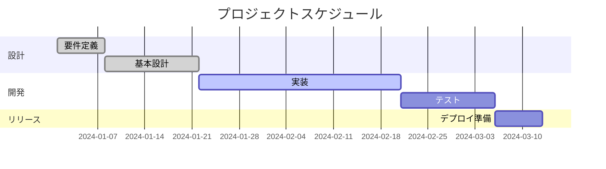

# Mermaid

Mermaidはテキストベースで図を記述できるツールである。本プロジェクトでは推奨ツールとして位置づけている。

## 基本的な使い方

Markdownファイル内で、以下のようにコードブロックを記述する。

````markdown

````

## フローチャート

処理の流れを表現する基本的な図である。



### 記法のポイント

- `graph TD`: 上から下へ流れる図（Top to Down）
- `graph LR`: 左から右へ流れる図（Left to Right）
- `[テキスト]`: 四角形のノード
- `{テキスト}`: ひし形のノード（条件分岐）
- `-->`: 矢印
- `-->|ラベル|`: ラベル付き矢印

## シーケンス図

オブジェクト間のやり取りを時系列で表現する。



### 記法のポイント

- `participant`: 参加者を定義
- `->>`: 同期メッセージ
- `-->>`: 応答メッセージ
- `activate/deactivate`: 活性化バーの表示

## 状態遷移図

システムやオブジェクトの状態の変化を表現する。



### 記法のポイント

- `[*]`: 開始・終了状態
- `状態名`: 状態を定義
- `-->`: 遷移

## クラス図

クラスの構造と関係を表現する。



### 記法のポイント

- `class クラス名`: クラスを定義
- `+`: public
- `-`: private
- `<|--`: 継承関係

## ER図

データベースのエンティティと関係を表現する。



### 記法のポイント

- `||--o{`: 1対多の関係
- `||--|{`: 1対1以上の関係
- `PK`: 主キー
- `FK`: 外部キー

## ガントチャート

プロジェクトのスケジュールを表現する。



## 参考リンク

- [Mermaid公式ドキュメント](https://mermaid.js.org/)
- [Mermaid Live Editor](https://mermaid.live/)
