# 生成AI時代のドキュメント基盤の構築

これはPR差分用のコメントです。

--- 

## ドキュメントの重要性

生成AIの活用が進み、ドキュメントの重要性の再認識

<!--
さてみなさん、生成AI活用されていますか？

生成AIの活用がどんどん進む中で、ドキュメントの重要性が再認識されていると思います。
-->

--- 

## 生成AI活用にも注目

- AWS - Kiro
- GitHub - Spec Kit
- Fission-AI - OpenSpec
- gotalab - cc-sdd

<!--
そんな中、生成AIを活用した開発支援が広がり、ドキュメントの重要性もあらためて注目されています。
AWSからはKiro、GitHubからはSpec Kitのような取り組みも登場しています。
-->

--- 

# 新たな課題の出現

<!--
そうした中で、ドキュメントを扱う上で、新たな課題も出現しています。
とくににドキュメントの納品が求めらえがちな受託開発案件では顕著な課題かと思います。
-->

--- 

## ドキュメントの2つの課題

- ドキュメント体系
- ドキュメント基盤

<!--
ソフトウェア開発におけるドキュメントを考えたとき
ドキュメント体系と、ドキュメント基盤の2つの視点に分けて
考える事もできるかと思います。

ちなみにこの考え方は近い考えはありますが、必ずしも普遍的なものではなく
あくまで本発表における定義です。
-->

--- 

## ドキュメント体系

ソフトウェア開発プロセスの中で

- どのタイミングで
- 何を文章化し
- どうコードとコラボレーションするか

<!--
本発表でいうドキュメント体系とは、それこそドキュメントの本質です。

ソフトウェア開発プロセスの中で、どのタイミングで、何を文章化し、どうコードとコラボレーションするか、という視点です。

生成AI活用時代のドキュメント運用の本質に関わる部分でもありますね。
-->

--- 

## ドキュメント基盤

- どのように作成し
- どのようにレビューし
- どのように閲覧し
- どのように配布するか？

<!--
一方でドキュメント基盤とは、ドキュメントをどのように作成・レビューし、どう閲覧し、どう配布するか、という視点です。

ドキュメント体系を支える基盤であり、技術的な側面が強い部分です。
-->

---

## 2つの視点

- ドキュメント体系 : どう構成し、どのように役割分担するか
- **ドキュメント基盤** : どのように作成・レビューし、どう閲覧し、どう配布するか

後者が本発表のスコープです。

<!--
そして本発表のスコープは、ドキュメント基盤の部分です。
-->

---

## 本ドキュメント基盤の発端

- 7年前、MS Officeから脱却を決意

---

## 本ドキュメント基盤の発端

- 7年前、MS Officeから脱却を決意
- WordやExcelで「きれいに書く事」に時間をかける事が負担
- 複数人で並列作業する事の難しさ
- コードと文書のバージョン同期の難しさ
- 平行作業時のレビューの難しさ

---

## 6時間かけて書いたWordが崩壊してキレた

---

## Markdownベース文書への移行を決意

---

## 本ドキュメント基盤の実績

- 大手金融3社のSIプロジェクト
- Markdownベース
- 800ページ超
- 最長7年の持続性

これらの事例とノウハウを紹介します。

<!--
私たちは7年前、従来のOffice文書ベースのドキュメントから脱却することを決意し
Markdownベースのドキュメント基盤を構築・運用してきました。

比較的ドキュメントへの要求水準が高い、大手金融3社のSIプロジェクトで800ページを超えるドキュメントを
最長7年にわたり持続的に運用してきました。

この7年の間に、多くの苦労を経験し、ノウハウを得ることができました。

本発表では、私たちが実践してきた事例とノウハウを包括的に紹介します。
-->

---

## 自己紹介

- T.B.D

- T.B.D

---

## ドキュメント基盤要件

- AIフレンドリー
- 単純な図の簡便な作成
- 複雑な図を正確に描画
- 表の簡便な作成
- 単一PDF出力

- git管理
- PRベースレビュー
- PR時のステージング
- CI/CD

- 検索を含めた高い閲覧性
- 高い拡張性
- 十分なセキュリティ
- 低コスト
- 保守ステージのコスト0

--- 

# デモンストレーション

---

## デモの流れ

1. Markdown ファイルの作成・閲覧
1. Mkdocs によるサイト閲覧・PDF出力
1. Mermaid / draw.io による作図
1. Copy To Markdown Excel アドインによる 表の管理
1. ソース と ドキュメント の一元管理
1. レビュー と ステージング環境
1. CI / CD
1. おすすめ３機能（MkDocs の検索 / Csv の埋め込み / Marp によるスライド作成）

---

## PDF 出力の流れ

[ドキュメンテーション戦略.pdf](https://genai-docs.github.io/genai-mkdocs-sample/pdf/ドキュメンテーション戦略.pdf)
