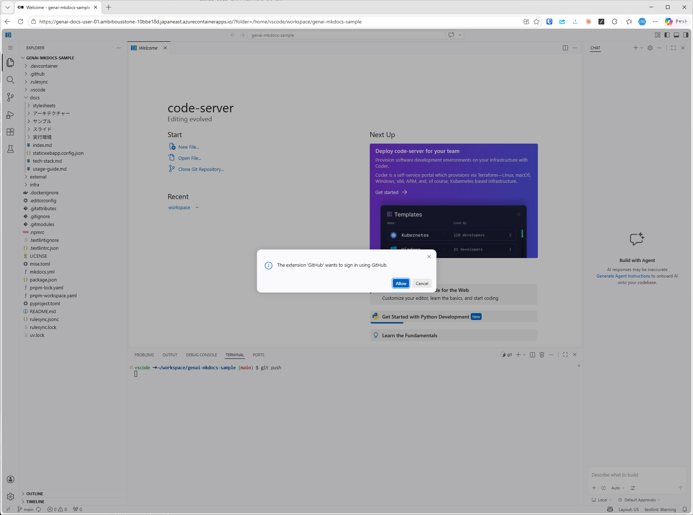
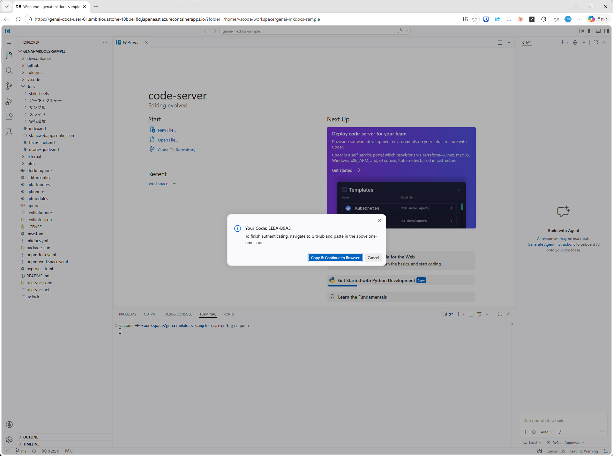
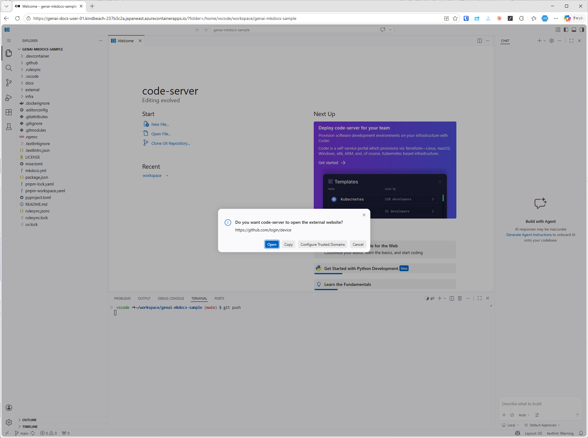
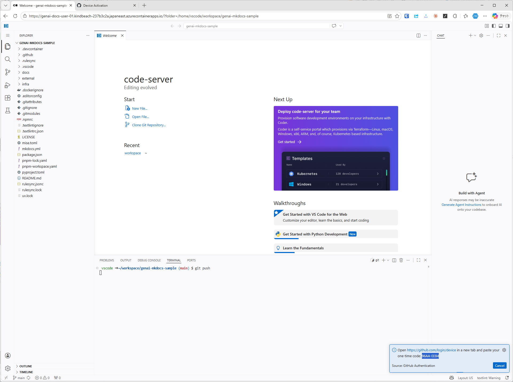
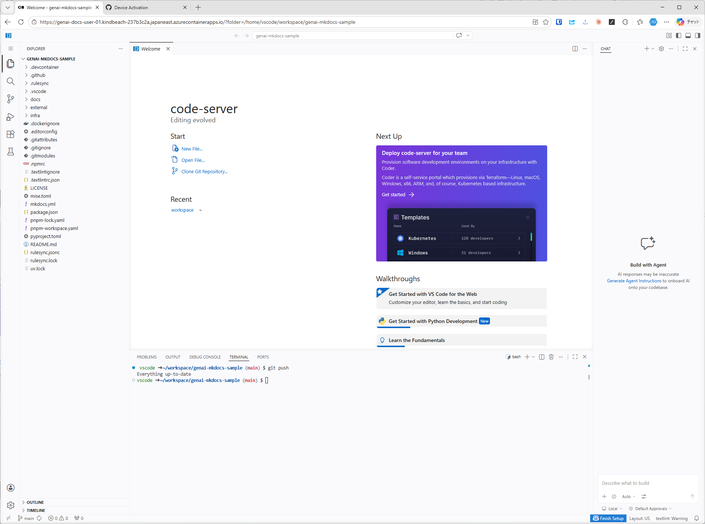

# GitHub リポジトリの準備

`genai-docs/genai-mkdocs-sample` を自分のアカウントにForkし、そのクローンURLをVS Codeのターミナルから `git clone` する。

## 1. リポジトリを開く

対象リポジトリのトップページを開く。


## 2. Fork を作成する

`Fork` ボタンから **自分のアカウント** をOwnerに指定して `Create fork` をクリックする。


## 3. クローン URL をコピーする

Forkした **自分のリポジトリ** を開き、`Code` → `HTTPS` タブからURLをコピーする。以降の `git clone` にはこのURLを使う。


## 4. VS Code でターミナルを開いてクローンする

VS Code上で `Ctrl + @` を押してターミナルを開き、コピーした **自分の Fork リポジトリの URL** を指定して `git clone` を実行する。

```bash
git clone https://github.com/<your-account>/genai-mkdocs-sample.git
```

`<your-account>` は自分のGitHubアカウント名に読み替える。

## 5. クローンしたフォルダーを開き直す

`File` → `Open Folder...` から下記のパスを入力し、クローンしたリポジトリを開き直す。

```text
/home/vscode/workspace/genai-mkdocs-sample/
```


## 6. GitHub アカウントでサインインする

VS Code上で `Ctrl + @` を押してターミナルを開き、git push を実行する。初回はGitHubアカウントでのサインインが求められるので、画面の指示に従ってサインインする。

```bash
git push
```

「Allow」を選択してサインインを許可する。



「Copy and Continue to Browser」を選択。



「Open」を選択してブラウザでGitHubの認証ページを開く。



Device Codeのコピーが求められますが、コピーが上手くいかない場合、VS Codeの画面にDevice Codeが表示されているので、そちらをブラウザの入力欄に直接入力しても認証する。



gitの空pushが成功していればOK。



## 6. Gitのユーザー名とメールアドレスを設定する

```bash
git config --global user.name "Your Name"
```

```bash
git config --global user.email "your_email@example.com"
```
